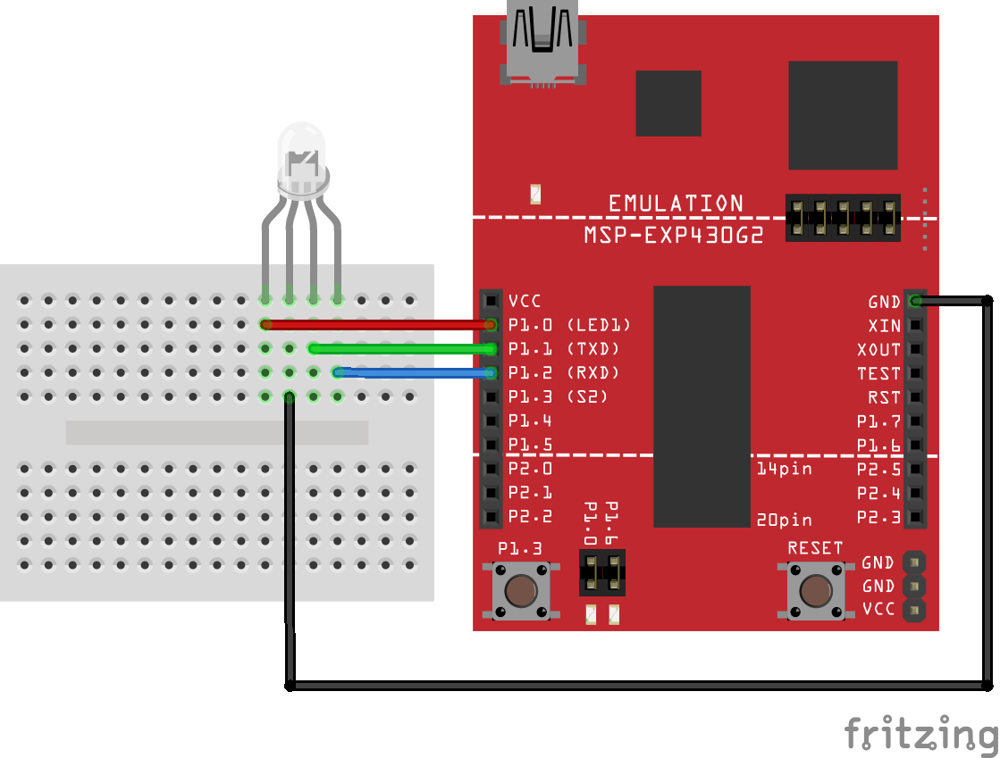

# Assignment Two: RGB LED

### Schematic

### Objective

For this assignment, you should try to cycle through the available colors when the onboard switch is pressed. The following colors can be displayed:

1. Red
1. Green
1. Blue
1. Yellow
1. Cyan
1. Purple
1. White

The order in which they are displayed isn't important. You should use an _interrupt_ for this, as your microcontroller will use less power this way. The included code has something set up for you (see the comments).

I'm not going to set a due dat for this one, just experiment to see what you can accomplish and we will talk about it in class on Monday.
