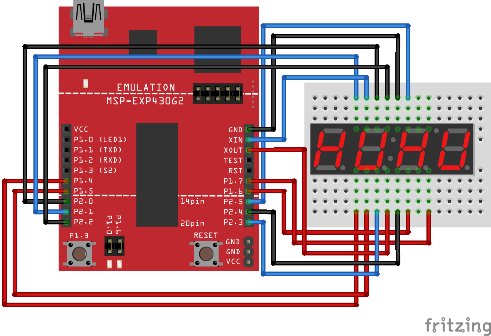

# Assignment Four: Display

### Schematic



All of the red wires are wires you need to _power_ and the black or blue wires are ones that need to be _grounded_.

### Objective

For this assignment, you should implement the `shell_cmd_hexd` function so that the first two characters of the first argument are parsed into ascii hex codes and shown on the 7-segment display. Please, always keep the colon separator **on** while the program is running.

The completed program will have an implementation of the above mentioned function as well as some initialization and a single interrupt on **TIMER0_A0_VECTOR** that will handle all of the display code.

### Extra Credit

Ensure the display begins blank (only the colon separator is on) and *do not* display the unused digits. For example, if you executed:

```
$ hexd a
```

Only the first two digits will turn on displaying `61`. Also implement a display clearing routine using the onboard switch and the **PORT1_VECTOR** interrupt. When the switch is pressed, the display should clear out, leaving only the colon separator on.
