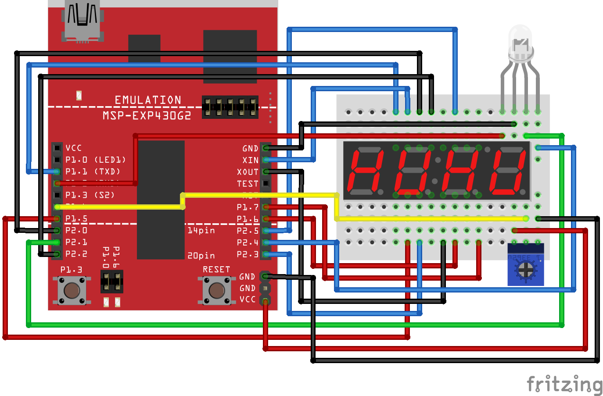

# Assignment Four: Color Selector

### Schematic

These are my recommended modifications to the previous assignment wiring. _Please read it carefully!_ We do not have the luxury of placing all of the pins for segments on one port as we did previously, we need to move them around in order to use three PWM channels (P1.2, P2.1, P2.4). There is a lot of wiring here, so _do things in stages and test as you add modules to your board!_ This is _critial_ for this assignment.

### Design

I know nobody likes writing pseudocode, and in the past, Dr. Trenary had required people to submit a design document for a project like this that would lay out the steps necessary for completion. _I am not going to require this_. But, it is very much in your best interest to _plan ahead_ your design for this project. Think about all of the blocks of code you will need in order to get the final result. _Actually write them down_. Do not just keep them in your head.

I don't necessarily want to tell students how to code, but the design of your program is a critical step _that should occur before the coding of said program!_

### Objective

For this assignment, you are to create a color selector using the RGB LED, potentiometer and 7-segment display. The behavior should be as follows:

1. On start up, green and blue should be off and the red color should be "selected".
    - the intensity of the red element is set using the potentiometer and
    - the value of that intensity should be shown on the 7-segment display (`_r00` - `_rFF`).
    - _Note that this means you have to change a value from the range `0` - `1023` to the range `0` - `255`._
1. Pressing the onboard switch selects the next color: green or blue (it doesn't really matter which).
1. The intensity of the red element is _left at what it was set when the switch was pressed_.
1. Now the next color can be set and the value of the intensity shown on the display (`_g00` - `_gFF`) or (`_b00` - `_bFF`).
    - for green, you can use a lowercase `g` (a `9` with the bottom segment turned on)
1. Repeat for the _next_ color.
1. Pressing the switch a third time should cycle back to setting the red color.

This means, in software we are utilizing:

1. All 3 PWM channels (T0.1, T1.1, T1.2)
1. A timer interrupt for the display
    - _Note that this means one of the timers is doing both PWM and an interrupt!_
1. A button interrupt
1. The ADC10 module for analog input
    - a code file `dtc.c` is provided that implements an `initialize_dtc()` function, use this to work with the potentiometer!

That's it! Good luck and have fun!

